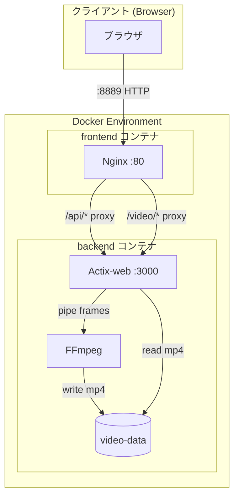
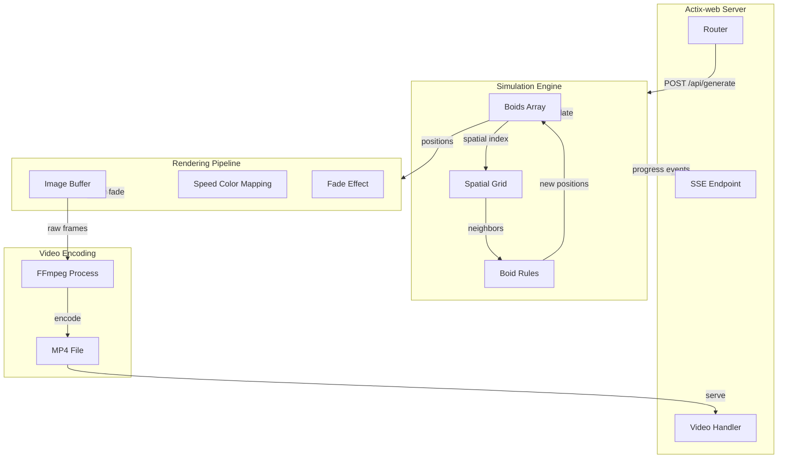
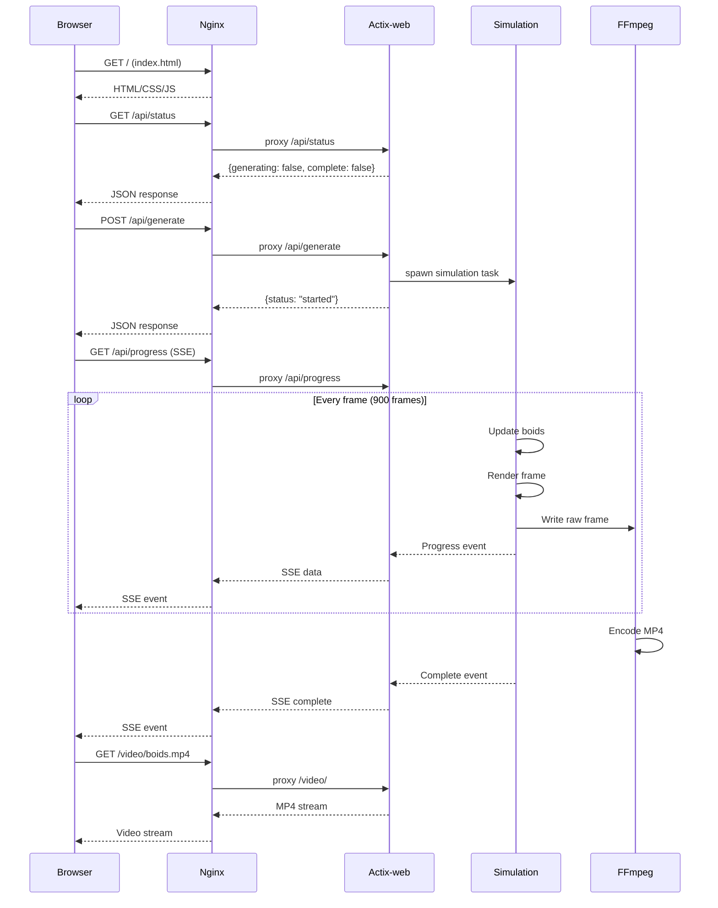

# Architecture

## ディレクトリ構成

```
massive-boids-stream/
├── PROMPT.md               # 要求仕様
├── README.md               # プロジェクト概要
├── Dockerfile              # Rustバックエンドのビルド
├── docker-compose.yml      # コンテナオーケストレーション
├── nginx.conf              # Nginx設定
├── .gitignore              # Git除外設定
├── backend/                # Rustバックエンド
│   ├── Cargo.toml          # Rust依存関係
│   └── src/
│       └── main.rs         # メインアプリケーション
├── doc/                    # ドキュメント
│   └── architecture.md     # 本ファイル
└── src/                    # フロントエンド
    ├── index.html          # メインページ
    └── summary.html        # プロンプト要約ページ
```

## 使用ライブラリ一覧

### Rustバックエンド

| ライブラリ | バージョン | 用途 |
|-----------|-----------|------|
| actix-web | 4 | HTTPサーバー |
| actix-rt | 2 | 非同期ランタイム |
| actix-files | 0.6 | ファイル配信 |
| tokio | 1 | 非同期ランタイム |
| rayon | 1.8 | 並列計算 |
| image | 0.24 | 画像生成 |
| rand | 0.8 | 乱数生成 |
| serde | 1 | シリアライズ |
| serde_json | 1 | JSON処理 |
| env_logger | 0.10 | ログ出力 |
| log | 0.4 | ログ抽象化 |
| futures | 0.3 | 非同期ユーティリティ |

### フロントエンド

| ライブラリ | バージョン | 用途 |
|-----------|-----------|------|
| (なし) | - | バニラJavaScriptで実装 |

## コンテナレベルのデータフロー



## モジュールレベルのデータフロー



## シーケンス図



## Boidsアルゴリズム

3つの基本ルールで群れ行動をシミュレート:

| ルール | 説明 | 半径 | 重み |
|--------|------|------|------|
| Separation (分離) | 近くの仲間から離れる | 8px | 1.5 |
| Alignment (整列) | 近くの仲間と同じ方向に進む | 25px | 1.0 |
| Cohesion (結合) | 近くの仲間の中心に向かう | 25px | 1.0 |

### 空間分割による最適化

10万点の近傍探索を効率化するため、グリッドベースの空間分割を使用:

- セルサイズ: 30px
- 計算量: O(n) (ナイーブ実装の O(n²) から改善)

## 視覚効果

### 残像フェード

各フレームで前フレームの色を92%に減衰させることで、残像効果を実現。

### 速度カラーマッピング

| 速度 | 色 |
|------|-----|
| 低速 (2.0) | 青 RGB(30, 144, 255) |
| 高速 (4.0) | オレンジ RGB(255, 140, 0) |

速度に応じて線形補間で色を決定。
